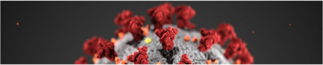

# SARS-CoV-2 Lineage Evaluation

Like most RNA viruses, SARS-CoV-2 is actively mutating, and there are already thousands of (slightly) different SARS-CoV-2 genomes worldwide. The minute variations between these lineages are not large enough to warrant distinction as a strain (i.e. a variant expressing unique physical and behavioral properties). It is currently unclear how these different lineages compare in terms of their severity and the speeds at which they spread. However, as the virus continues to spread, it is more likely to mutate into faster-spreading or more lethal strains.

This project aims to mitigate this issue by predicting the origin regions of SARS-CoV-2 lineages based on their genomes. This model aids two primary objectives. First, it enables a direct form of **contact tracing**: by identifying the lineages afflicting COVID-19 patients, one may reverse-engineer the paths by which particular lineages were transmitted on a large scale. Second, it allows for **suppression**: countries and regions at which thousands of lineages originated can take immediate action, shutting down immigration, emigration, and interstate travel.

Ultimately, we achieve an accuracy of 95.2% using L1 normalization on logistic regression.

This project was conducted under the mentorship of James Thomson at Inspirit AI, June 2020.
